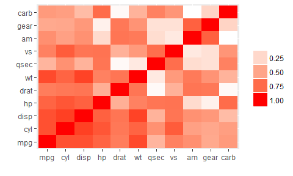
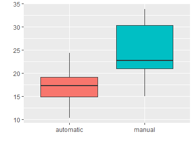
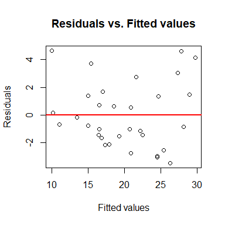
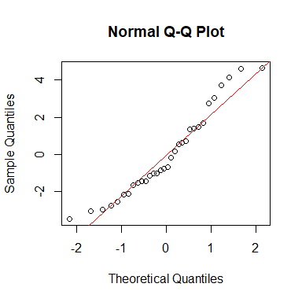

## Executive summary

Based on cars data extracted from the 1974 Motor Trend US magazine, the following paper will give an attempt at analysing whether automatic or manual transmissions are better for fuel efficiency as well as trying to quantify fuel efficiency differences between automatic and manual transmissions.

Based on the sample at hand, we will demonstrate that there may indeed be a relationship between fuel efficiency and type of transmission, pointing towards manual cars being more fuel efficient.

## Exploratory data analysis


The `mtcars` data set is data frame with 32 observations on 11 variables, of which the following are particularly interesting to this paper:

* `mpg`: miles per gallon
* `wt`: weight in 1,000 lbs
* `cyl`: number of cylinders
* `disp`: displacement in cubic inches
* `qsec`: quarter mile time in seconds
* `am`: transmission (0 for automatic and 1 for manual).

If we plot a heatmap of variable absolute correlations (see **Figure 1**), we see that fuel efficiency (`mpg`) seems to be highly correlated to weight (`wt`), number of cylinders (`cyl`) and displacement (`disp`) but does not seems to be higly correlated with transmission (`am`).

In our case, we are however interested to know to what extent `mpg` and `am` are related and thus isolate these two variables to visualise them in a boxplot (see **Figure 2**). In this plot, we see that, for our sample, the mean of `mpg` for automatic transmissions is 17.15 whereas the mean of `mpg` for manual transmissions is 24.39. This may be an indicator of the fact that manual transmissions are more fuel efficient (higher `mpg` value) than automatic transmissions and so we will build a linear model containing `am` as regressor to test the following hypotheses: 

* Null hypothesis (H<sub>0</sub>): There is no linear relationship between `mpg` and `am` ($\beta_{am} = 0$)
* Alternative hypothesis (H<sub>a</sub>): There is a positive linear relationship between `mpg` and `am` ($\beta_{am} \neq 0$)

## Model selection

For selecting our variables, we apply the backward selection methodology, whereby we first fit a model including all variables and remove each time the least significant variable from the model until we are left with only statistically significant variables (see **Figure 3**). Our final model includes the variables `wt`, `qsec` and `am` with the following coefficients: 


```
##              Estimate Std. Error   t value     Pr(>|t|)
## (Intercept)  9.617781  6.9595930  1.381946 1.779152e-01
## wt          -3.916504  0.7112016 -5.506882 6.952711e-06
## qsec         1.225886  0.2886696  4.246676 2.161737e-04
## factor(am)1  2.935837  1.4109045  2.080819 4.671551e-02
```

This model would mean that, with weight (`wt`) and quarter miles (`qsec`) remaining constant, having a manual transmission (`am` = 1) would increase the number of miles that a car is able to cover with one gallon of fuel by **2.94**. This therefore goes in the direction of the alternative hypothesis.

## Diagnostics

For making inferences on a slope of a linear model, we need to meet the following conditions: 

* Our sample is a simple random sample from the population: For the purpose of our analysis, we need to assume that this condition is fulfilled.
* There is a linear relationship between our outcome and our predictors in the population: We can verify this by plotting residuals vs. fitted values (see **Figure 4**), where we see that residuals are fairly spread randomly around the 0 line indicating that the relationship is linear. 
* The variance of the responses around the population line is the same for all values of the explanatory variables: We can verify this also by plotting residuals vs. fitted values (see **Figure 4**), where we see that the residuals form an approximate horizontal band around the 0 line indicating homogeneity of variance.
* The response varies normally around the population regression line: We can verify this with a Q-Q plot (see **Figure 5**) indicating that, with the exception of the tails, the distribution of the residuals is quite close to the normal distribution.

The above conditions are approximately satisfied and we can therefore make inferences on the slopes of our linear model, especially the slope corresponding to the variable `am`.

## Inference

### P-value

In our model, the p-value for the `am` coefficient is as follows:


```
## [1] 0.04671551
```

The calculated p-value is lower than 0.05 and we can thus reject H<sub>0</sub>, which suggests that H<sub>a</sub> is valid.

### Confidence interval

We can calculate a 95% confidence interval for the coefficient of `am` as follows:


```
##                  2.5 %   97.5 %
## factor(am)1 0.04573031 5.825944
```

The calculated confidence interval does not overlap with zero and we can thus reject H<sub>0</sub>, which suggests that H<sub>a</sub> is valid.

## Conclusion

Our analysis suggests that there is indeed a relationship between the fuel efficiency and the type of transmission (automatic vs. manual) of cars. In our case, this relationship appears to point in the direction of manual transmissions being more fuel efficient than automatic transmissions. In order to validate this conclusion, the following next steps could be envisaged:

* Outliers investigation and elimimation
* Fitting of a new linear model after outliers elimination
* As appropriate, test whether $\beta_{am} > 0$ instead of $\beta_{am} \neq 0$

We should further note that the inferences made as part of this analysis are based on measurements from 1974 and intend by no means to extend to today's manual vs. automatic cars.

## Appendix
#### Figure 1: Absolute correlations between variables
<!-- -->

#### Figure 2: Comparison of mpg values for automatic vs. manual
<!-- -->

#### Figure 3: Backward selection of variables

```r
# First model containing all variables
summary(lm(mpg ~ cyl + disp + hp + drat + wt + qsec + factor(vs) + factor(am) + gear + carb, data = mtcars))$coefficients
```

```
##                Estimate  Std. Error    t value   Pr(>|t|)
## (Intercept) 12.30337416 18.71788443  0.6573058 0.51812440
## cyl         -0.11144048  1.04502336 -0.1066392 0.91608738
## disp         0.01333524  0.01785750  0.7467585 0.46348865
## hp          -0.02148212  0.02176858 -0.9868407 0.33495531
## drat         0.78711097  1.63537307  0.4813036 0.63527790
## wt          -3.71530393  1.89441430 -1.9611887 0.06325215
## qsec         0.82104075  0.73084480  1.1234133 0.27394127
## factor(vs)1  0.31776281  2.10450861  0.1509915 0.88142347
## factor(am)1  2.52022689  2.05665055  1.2254035 0.23398971
## gear         0.65541302  1.49325996  0.4389142 0.66520643
## carb        -0.19941925  0.82875250 -0.2406258 0.81217871
```

```r
# After removing disp
summary(lm(mpg ~ cyl + hp + drat + wt + qsec + factor(vs) + factor(am) + gear + carb, data = mtcars))$coefficients
```

```
##                Estimate  Std. Error     t value   Pr(>|t|)
## (Intercept) 12.55052401 18.52585292  0.67745998 0.50517673
## cyl          0.09626514  0.99714976  0.09654031 0.92396553
## hp          -0.01294980  0.01834172 -0.70602963 0.48757974
## drat         0.92863866  1.60794081  0.57753286 0.56944371
## wt          -2.62694278  1.19799968 -2.19277418 0.03918971
## qsec         0.66523397  0.69335219  0.95944597 0.34776076
## factor(vs)1  0.16035155  2.07276717  0.07736110 0.93903556
## factor(am)1  2.47881882  2.03512903  1.21801556 0.23612039
## gear         0.74299607  1.47360490  0.50420304 0.61913110
## carb        -0.61685611  0.60566027 -1.01848535 0.31951774
```

```r
# After removing vs
summary(lm(mpg ~ cyl + hp + drat + wt + qsec + factor(am) + gear + carb, data = mtcars))$coefficients
```

```
##                Estimate Std. Error     t value   Pr(>|t|)
## (Intercept) 12.41462256 18.0394512  0.68819292 0.49821421
## cyl          0.06832122  0.9091198  0.07515095 0.94074444
## hp          -0.01258168  0.0173267 -0.72614376 0.47507594
## drat         0.93092187  1.5725461  0.59198385 0.55963626
## wt          -2.65054081  1.1332035 -2.33898050 0.02838947
## qsec         0.68738469  0.6176728  1.11286221 0.27726401
## factor(am)1  2.44604715  1.9470629  1.25627537 0.22162714
## gear         0.74709867  1.4404763  0.51864696 0.60896134
## carb        -0.61845947  0.5920810 -1.04455209 0.30708483
```

```r
# After removing cyl
summary(lm(mpg ~ hp + drat + wt + qsec + factor(am) + gear + carb, data = mtcars))$coefficients
```

```
##                Estimate  Std. Error    t value   Pr(>|t|)
## (Intercept) 13.49214825 10.71793540  1.2588384 0.22019619
## hp          -0.01214723  0.01599192 -0.7595855 0.45489926
## drat         0.89764428  1.47732485  0.6076147 0.54914978
## wt          -2.62772204  1.06891026 -2.4583187 0.02155834
## qsec         0.65845379  0.47291720  1.3923236 0.17659196
## factor(am)1  2.41351133  1.85857865  1.2985791 0.20642800
## gear         0.70547380  1.30189358  0.5418828 0.59289509
## carb        -0.61460327  0.57750485 -1.0642391 0.29781122
```

```r
# After removing gear
summary(lm(mpg ~ hp + drat + wt + qsec + factor(am) + carb, data = mtcars))$coefficients
```

```
##                Estimate  Std. Error    t value    Pr(>|t|)
## (Intercept) 14.55109853 10.38833044  1.4007158 0.173589663
## hp          -0.01173947  0.01574692 -0.7455089 0.462916361
## drat         1.07284911  1.42099878  0.7549965 0.457305280
## wt          -2.82895266  0.98806815 -2.8631149 0.008368322
## qsec         0.70712278  0.45770383  1.5449353 0.134927660
## factor(am)1  2.85861089  1.64349894  1.7393445 0.094274735
## carb        -0.45444602  0.48908371 -0.9291784 0.361682165
```

```r
# After removing hp
summary(lm(mpg ~ drat + wt + qsec + factor(am) + carb, data = mtcars))$coefficients
```

```
##               Estimate Std. Error    t value    Pr(>|t|)
## (Intercept)  9.9242985  8.2592008  1.2016052 0.240347811
## drat         1.2070622  1.3974554  0.8637572 0.395619972
## wt          -3.1108432  0.9050238 -3.4373056 0.001988359
## qsec         0.9145380  0.3603192  2.5381332 0.017476995
## factor(am)1  2.9639102  1.6233702  1.8257759 0.079391329
## carb        -0.6023241  0.4432180 -1.3589794 0.185825976
```

```r
# After removing drat
summary(lm(mpg ~ wt + qsec + factor(am) + carb, data = mtcars))$coefficients
```

```
##               Estimate Std. Error   t value    Pr(>|t|)
## (Intercept) 12.8971970  7.4724922  1.725957 0.095783676
## wt          -3.4343216  0.8200199 -4.188095 0.000268619
## qsec         1.0191298  0.3377635  3.017288 0.005507044
## factor(am)1  3.5113918  1.4874727  2.360643 0.025720752
## carb        -0.4886034  0.4212171 -1.159980 0.256211958
```

```r
# After removing carb (final mode as all coefficients are now statistically significant)
summary(lm(mpg ~ wt + qsec + factor(am), data = mtcars))$coefficients
```

```
##              Estimate Std. Error   t value     Pr(>|t|)
## (Intercept)  9.617781  6.9595930  1.381946 1.779152e-01
## wt          -3.916504  0.7112016 -5.506882 6.952711e-06
## qsec         1.225886  0.2886696  4.246676 2.161737e-04
## factor(am)1  2.935837  1.4109045  2.080819 4.671551e-02
```

#### Figure 4: Plot of residuals vs. fitted values
<!-- -->

#### Figure 5: Q-Q plot of residuals
<!-- -->
